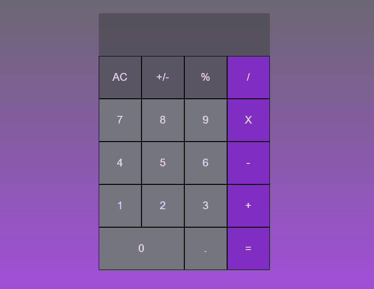

# 🖥 "Calculadora" 🚀
## 📑 Descrição
Calculadora feita com CSS grid bidemensinal,dividi a tela em linhas e colunas facilitando colocar os elementos onde queremos.
## ⏱ Processo
- HTML
-  CSS Grid
- JavaScript
## ⏲ Função
Conseguimos fazer todos os tipos de cálculos.

## 🚀A página👌

<a href="https://preeminent-yeot-330458.netlify.app/" target= "-blank">Acesse a página online</a>

## 🧞‍♀️ Desenvolvedora

<table align="center">
  <tr>
    <td align="center">
      

         
          <b> Claudinéia Torres </b> 
            
            
      

    </td>

  </tr>
</table>